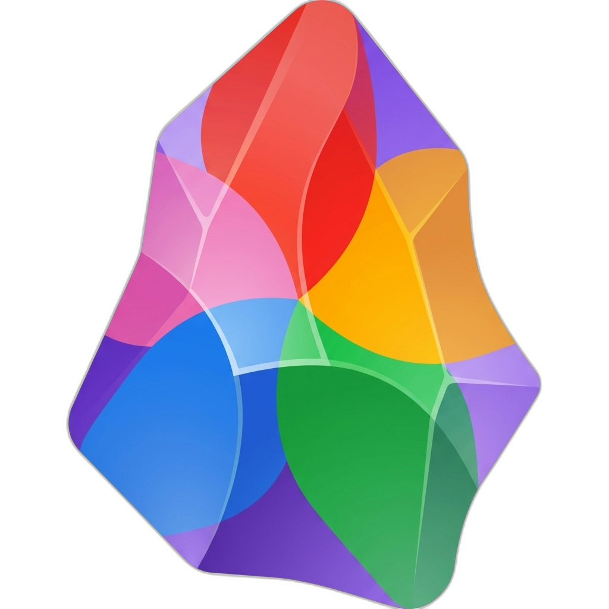
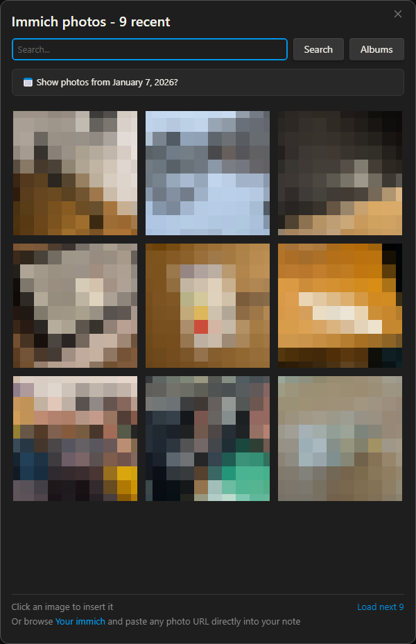
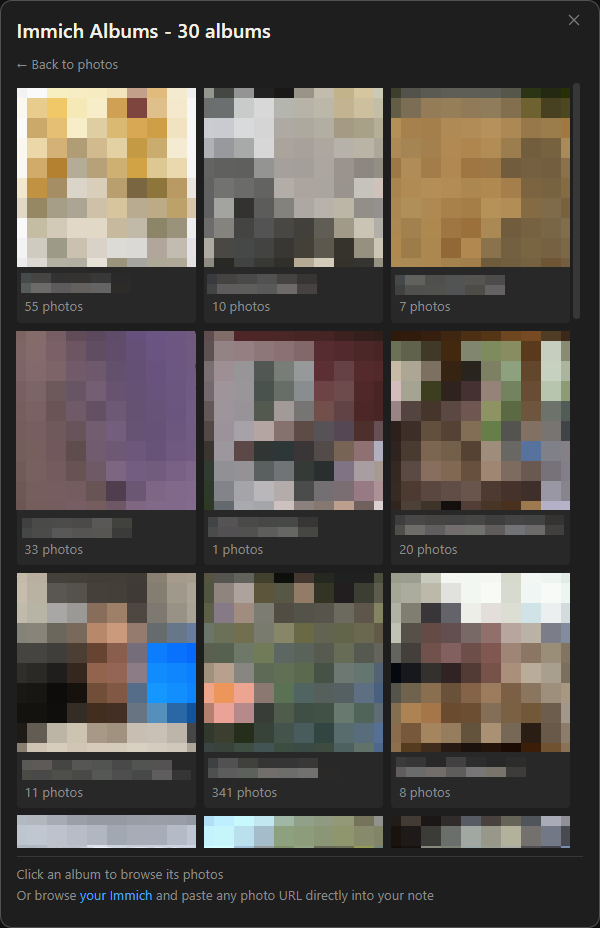

<p align="center">
  
</p>

<h1 align="center">Obsidian Immich Picker</h1>

<p align="center">
  Insert images from a self-hosted <a href="https://immich.app/">Immich</a> photo server into your Obsidian notes.<br/>
  Browse, search, and embed photos with flexible storage options.
</p>

<p align="center">
  Adapted from <a href="https://github.com/alangrainger/obsidian-google-photos">obsidian-google-photos</a> by Alan Grainger.
</p>

---





## Features

- **Photo Picker**: Browse and select from your recent Immich photos via command palette
- **Smart Search**: Search using Immich's AI-powered CLIP search (e.g., "beach sunset", "birthday party")
- **Album Browsing**: Browse albums, view contents, insert single photos or entire albums
- **Date Filtering**: Detect dates from note titles or frontmatter and show photos from that day
- **Paste URL Conversion**: Automatically converts pasted Immich photo URLs into embedded images
- **Three Image Modes**: Local thumbnails, remote server links, or public shared links
- **Bulk Conversion**: Convert images between formats by note, folder, tag, or entire vault
- **Secure API Key Storage**: Uses OS credential manager on Obsidian 1.11+, falls back to plugin data on older versions

## Image Lifecycle

Images don't just live in Obsidian. You might publish to a blog, share markdown files, migrate to another app, or process notes with scripts. This plugin gives you control over how images are stored and lets you convert between formats as your needs change.

```
                    +-------------+
                    |   Immich    |
                    |   Server   |
                    +------+------+
                           |
              +------------+------------+
              v            v            v
        +----------+ +----------+ +----------+
        |  Local   | |  Remote  | |  Shared  |
        | Download | |  Server  | |  Public  |
        |          | |  Link    | |  Link    |
        +----+-----+ +----+-----+ +----+-----+
             |            |            |
             v            v            v
        In vault     Standard MD   Public URL
        offline      needs plugin  works anywhere
             |            |            |
             +------------+------------+
                          |
                 Convert between formats
                 (by note, folder, tag, vault)
                          |
              +-----------+-----------+
              v           v           v
         Export to    Share with   Migrate to
         blog/CMS    colleagues   other apps
```

### Image Modes

| Mode | How it works | Best for |
|------|-------------|----------|
| **Local** | Downloads thumbnail to your vault | Offline access, migration, publishing |
| **Remote** | Standard markdown link to Immich server, plugin authenticates at render time | Saving vault space, large photo collections |
| **Shared** | Creates public Immich shared link | Sharing notes with others, publishing |

### Converting Between Formats

Use the **Convert Immich images** command (Ctrl/Cmd+P) to open the conversion modal:

- **Scope**: Current note, a folder, notes with a specific tag, or entire vault
- **Target format**: Local thumbnails, server link, shared link, or code block
- **Preview**: Scan first to see how many images will be converted

This lets you keep images remote for daily use, then batch-convert to local when exporting or to shared links when publishing.

## Requirements

- A self-hosted [Immich](https://immich.app/) server
- An Immich API key with permissions:
  - `asset.read` - for searching photos
  - `asset.view` - for downloading thumbnails
  - `album.read` - for browsing albums (optional)

## Installation

> **Note:** This plugin is not yet in the official Obsidian community plugin list. A [PR has been submitted](https://github.com/obsidianmd/obsidian-releases/pull/9367) and is pending review.

### Using BRAT (Recommended)

1. Install the [BRAT plugin](https://github.com/TfTHacker/obsidian42-brat) if you haven't already
2. Open Obsidian Settings > BRAT
3. Click "Add Beta plugin"
4. Enter: `eikowagenknecht/obsidian-immich-picker`
5. Enable the plugin in Settings > Community Plugins

### Manual Installation

1. Download `main.js`, `manifest.json`, and `styles.css` from the [latest release](https://github.com/eikowagenknecht/obsidian-immich-picker/releases)
2. Create a folder named `immich-picker` in your vault's `.obsidian/plugins/` directory
3. Copy the downloaded files into this folder
4. Reload Obsidian and enable the plugin in Settings > Community Plugins

## Setup

1. Open Settings > Immich Picker
2. Enter your Immich server URL (e.g., `https://immich.example.com`)
3. Enter your API key (create one in Immich under Account Settings > API Keys)
4. Click "Test Connection" to verify

On Obsidian 1.11+, your API key is stored securely in your OS credential manager (Keychain on macOS, Credential Manager on Windows, libsecret on Linux). On older versions, it's stored in the plugin's data file.

## Usage

### Insert a Photo

1. Open the command palette (<kbd>Ctrl/Cmd</kbd> + <kbd>P</kbd>)
2. Search for "Insert image from Immich"
3. Browse recent photos, search, or browse albums
4. Click a photo to insert it

### Choose an Image Mode

In Settings > Immich Picker > Image mode:

- **Download to vault** (default): Saves a thumbnail file locally. Works offline, standard image embedding.
- **Load from Immich server**: Inserts a standard markdown image link. The plugin authenticates and loads the image at render time. No files saved to your vault.
- **Use Immich shared links**: Creates a public shared link in Immich. The image URL works anywhere without the plugin.

### Browse Albums

1. Open the photo picker
2. Click "Albums" (requires `album.read` permission)
3. Browse albums sorted by most recently updated
4. Click a photo to insert it, or "Insert all" for the entire album

### Filter by Note Date

If your note has a date in its title (e.g., `2024-01-15.md`) or frontmatter:

1. Configure date detection in Settings > Note Date Detection
2. Open the photo picker on a note with a detectable date
3. A banner appears suggesting photos from that date

### Paste Immich URL

Copy a photo URL from Immich (e.g., `https://immich.example.com/photos/abc-123`) and paste it into your note. The plugin will automatically convert it based on your current image mode setting.

### Convert Between Formats

Open the command palette and search for **"Convert Immich images"** to open the conversion modal:

1. Choose a **scope**: current note, folder, tag, or entire vault
2. Choose a **target format**: local thumbnails, server link, shared link, or code block
3. Click **Scan** to preview how many images will be converted
4. Click **Convert** to process

Quick single-note commands are also available:
- **Convert remote images to current format** (current note)
- **Convert remote images to local thumbnails** (current note)

### Mobile

All features work on mobile. For quick access, add commands to your mobile toolbar:

1. Go to **Settings > Toolbar**
2. Add "Insert image from Immich" for one-tap photo insertion

The [Commander](https://github.com/phibr0/obsidian-commander) plugin can also add Immich commands to the ribbon, context menus, and page headers.

## Settings

| Setting | Description | Default |
|---------|-------------|---------|
| Server URL | Your Immich server URL | - |
| API Key | Your Immich API key (stored securely on Obsidian 1.11+) | - |
| Image mode | How images are stored: local, remote, or shared | Local |
| Remote format | Server link (standard markdown) or code block | Server link |
| Photos per page | Photos loaded at a time | 9 |
| Grid columns | Columns in the photo grid | 3 |
| Date detection | Extract date from note title or frontmatter | Disabled |
| Thumbnail dimensions | Max width/height for local thumbnails | 400x280 |
| Storage location | Where to save local thumbnails | Same folder as note |
| Filename format | MomentJS format for saved files | `immich_YYYY-MM-DD--HH-mm-ss.jpg` |
| Markdown template | Output format for inserted images (local/shared modes) | `[]({{immich_url}})` |
| Convert pasted links | Auto-convert pasted Immich URLs | Enabled |

### Template Variables

| Variable | Description |
|----------|-------------|
| `{{local_thumbnail_link}}` | Path to the local thumbnail |
| `{{immich_thumbnail_url}}` | Direct thumbnail URL from the server |
| `{{immich_url}}` | URL to the photo in Immich |
| `{{immich_asset_id}}` | The Immich asset ID |
| `{{original_filename}}` | Original filename from Immich |
| `{{taken_date}}` | Date the photo was taken |
| `{{description}}` | Photo description from Immich |

Template presets are available in settings with recommendations based on your vault's link format (markdown vs wikilinks).

## Development

```bash
# Install dependencies
npm install

# Development mode (watch for changes)
npm run dev

# Production build
npm run build

# Lint
npm run lint
```

## Companion Plugins

These plugins work well alongside Immich Picker for image management:

| Plugin | What it adds |
|--------|-------------|
| [Image Converter](https://github.com/xRyul/obsidian-image-converter) | Drag-to-resize, compress, convert formats, batch processing, annotations |
| [Pixel Perfect Image](https://github.com/johansan/pixel-perfect-image) | Context menu resizing, scroll wheel zoom, percentage presets |
| [Image Toolkit](https://github.com/sissilab/obsidian-image-toolkit) | Full-screen preview, zoom, rotate, flip, pin multiple images |

Immich Picker inserts standard markdown image syntax that these plugins can enhance with visual resizing controls. You can also set a default display width in Immich Picker settings to control the initial size of inserted images.

## Roadmap

Planned features for future releases:

- **Visual size picker**: Click-to-choose image dimensions at insertion time with a visual grid overlay showing the photo at different preset sizes
- **Folder/file context menu**: Right-click a folder or file to convert all Immich images within
- **Mobile optimization**: Improved touch-friendly UI for the photo picker and conversion modal
- **Immich Public Proxy support**: Direct integration with [immich-public-proxy](https://github.com/alangrainger/immich-public-proxy) for secure public sharing

## Attribution

Based on [obsidian-google-photos](https://github.com/alangrainger/obsidian-google-photos) by Alan Grainger (GPL-3.0).

## License

GPL-3.0 - see [LICENSE](LICENSE) for details.
