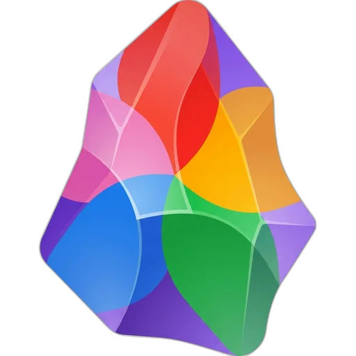

# Obsidian Immich Picker



An Obsidian plugin to insert images from a self-hosted [Immich](https://immich.app/) photo server. Pick photos from your recent uploads and embed them directly into your notes.

Adapted from [obsidian-google-photos](https://github.com/alangrainger/obsidian-google-photos) for Immich. I created this as an alternative to [his Templater script](https://github.com/almarber/immich-templater-script).


## Features

- **Photo Picker**: Command palette action to browse and select from your recent Immich photos
- **Smart Search**: Search your photos using Immich's AI-powered CLIP search (e.g., "beach sunset", "birthday party")
- **Album Browsing**: Browse your Immich albums, view album contents, and insert single photos or entire albums at once
- **Date Filtering**: Detect dates from note titles or frontmatter and show photos from that day
- **Paste URL Conversion**: Automatically converts pasted Immich photo URLs into embedded thumbnails
- **Image Modes**: Store images as local thumbnails, as links to your server, or as public shared links, and convert between them in bulk
- **Local & Public URLs**: Works with both local network URLs (e.g., `http://nas:2283`) and public URLs (e.g., `https://immich.example.com`)
- **Secure**: API key is stored in your OS credential manager, never embedded in your notes

## Requirements

- A self-hosted [Immich](https://immich.app/) server
- An Immich API key with the following permissions:
  - `asset.read` - for searching photos
  - `asset.view` - for downloading thumbnails
  - `album.read` - for browsing albums (optional)

## Installation

> **Note:** This plugin is not yet in the official Obsidian community plugin list. A [PR has been submitted](https://github.com/obsidianmd/obsidian-releases/pull/9367) and is pending review.

### Using BRAT (Recommended)

1. Install the [BRAT plugin](https://github.com/TfTHacker/obsidian42-brat) if you haven't already
2. Open Obsidian Settings → BRAT
3. Click "Add Beta plugin"
4. Enter: `eikowagenknecht/obsidian-immich-picker`
5. Enable the plugin in Settings → Community Plugins

### Manual Installation

1. Download `main.js`, `manifest.json`, and `styles.css` from the [latest release](https://github.com/eikowagenknecht/obsidian-immich-picker/releases)
2. Create a folder named `immich-picker` in your vault's `.obsidian/plugins/` directory
3. Copy the downloaded files into this folder
4. Reload Obsidian and enable the plugin in Settings → Community Plugins

## Setup

1. Open Settings → Immich Picker
2. Enter your Immich server URL (e.g., `https://immich.example.com`)
3. Enter your API key (create one in Immich under Account Settings → API Keys)
4. Click "Test Connection" to verify

Your API key is stored in your OS credential manager (Keychain on macOS, Credential Manager on Windows, libsecret on Linux), not in the plugin's data file. A key saved by an older version is migrated automatically on first load.

## Usage

### Insert Photo via Command

1. Open the command palette (<kbd>Ctrl/Cmd</kbd> + <kbd>P</kbd>)
2. Search for "Insert image from Immich"
3. Click on a photo to insert it

### Browse Albums

1. Open the photo picker via command palette
2. Click the "Albums" button (requires `album.read` permission)
3. Browse your albums sorted by most recently updated
4. Click an album to view its photos
5. Click a photo to insert it, or use "Insert all" to insert the entire album

### Filter by Note Date

If your note has a date in its title (e.g., `2024-01-15.md`) or frontmatter, the picker will suggest photos from that date:

1. Configure date detection in Settings → Note Date Detection
2. Open the photo picker on a note with a detectable date
3. A banner appears: "📅 Show photos from January 15, 2024?"
4. Click the banner to see all photos taken on that day

This is especially useful for daily notes or journal entries.

### Paste Immich URL

When you copy a photo URL from Immich (e.g., `https://immich.example.com/photos/abc-123`) and paste it into your note, the plugin will:

1. Detect the Immich URL
2. Download the thumbnail from your server
3. Save it locally using your configured settings
4. Insert the markdown with a clickable thumbnail linking to the original

This can be disabled in settings if you prefer to paste plain URLs.

### Choose How Images Are Stored

The **Image mode** setting controls what the plugin writes into your note:

| Mode | What it inserts | Notes |
|---------|-------------|---------|
| Local (default) | A thumbnail downloaded into your vault | Works offline and survives export |
| Remote | A markdown link to your Immich server | Nothing saved to your vault, but the plugin has to be installed to see the image |
| Shared | An Immich shared link | The URL works anywhere, and is readable by anyone who has it |

### Convert Between Formats

To move existing images from one mode to another, run "Convert Immich images" from the command palette:

1. Choose a scope: current note, a folder, or the whole vault
2. Choose the target format
3. Click "Scan" to see how many images will be converted
4. Click "Convert"

Converting to shared links asks for confirmation first, since those URLs are public and do not expire.

Conversion needs the note to record which Immich asset an image came from. Remote and shared images always carry it in their URL. Local images carry it only if your inserted text format includes `{{immich_url}}` or `{{immich_thumbnail_url}}` — the default and the "Markdown" preset do, the "Wikilink" and "Image only" presets do not. Images inserted with those two are skipped by the scan, because nothing in the note says which photo they are.

### Mobile

Everything works on mobile. The plugin adds a ribbon icon, reachable from the hamburger menu. To put it on the toolbar above the keyboard instead, go to Settings → Toolbar, tap +, and search for "Immich".

The [Commander](https://github.com/phibr0/obsidian-commander) plugin can also add Immich commands to the ribbon, context menus, and page headers.

## Settings

| Setting | Description | Default |
|---------|-------------|---------|
| Server URL | Your Immich server URL | - |
| API Key | Your Immich API key | - |
| Image mode | How images are stored (Local/Remote/Shared) | Local |
| Remote image format | Server link or code block, for remote mode | Server link |
| Render in edit mode | Show remote images inline while editing | Enabled |
| Display width | Default width for inserted images | Original size |
| Photos per page | Photos loaded at a time (recent, search, pagination) | 9 |
| Grid columns | Number of columns in the photo grid | 3 |
| Get date from | Where to extract date for filtering (Disabled/Note title/Frontmatter) | Disabled |
| Date format | MomentJS format for parsing dates | `YYYY-MM-DD` |
| Frontmatter key | Property name containing the date | `date` |
| Thumbnail width/height | Max dimensions for saved thumbnails | 400x280 |
| Location | Where to save thumbnails | Same folder as note |
| Filename format | MomentJS format for saved files | `immich_2024-01-01--23-59-59.jpg` |
| Markdown template | Output format for inserted images | `[]({{immich_url}})` |
| Convert pasted Immich links | Auto-convert pasted URLs to thumbnails | Enabled |

### Template Variables

- `{{local_thumbnail_link}}` - Path to the local thumbnail
- `{{immich_thumbnail_url}}` - Direct thumbnail URL on the server
- `{{immich_url}}` - URL to the photo in Immich
- `{{immich_asset_id}}` - The Immich asset ID
- `{{original_filename}}` - Original filename from Immich
- `{{taken_date}}` - Date the photo was taken
- `{{description}}` - Photo description from Immich

The settings tab offers a few presets for this, picked to match whether your vault uses markdown links or wikilinks.

## Development

```bash
# Install dependencies
npm install

# Development mode (watch for changes)
npm run dev

# Production build
npm run build

# Lint
npm run lint
```

## Attribution

Based on [obsidian-google-photos](https://github.com/alangrainger/obsidian-google-photos) by Alan Grainger (GPL-3.0).

## License

GPL-3.0 - see [LICENSE](LICENSE) for details.
